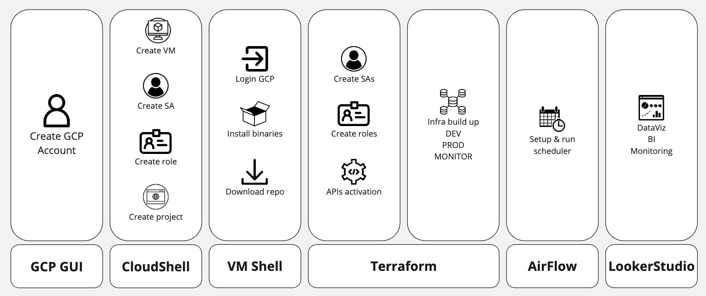

# Guía para el deploy

## Preparación del entorno y requerimientos del proyecto

Para ejecutar este proyecto necesitamos contar con las siguientes 
herramientas:

- Google Cloud SKD  
https://cloud.google.com/sdk/docs/install

- GitHub CLI (solo si vamos a usar una VM en GitHub en lugar de la de GCP)  
https://github.com/cli/cli/releases/latest 

- Terraform  
https://developer.hashicorp.com/terraform/install

- Docker  
https://docs.docker.com/get-docker/

- Python  
https://www.python.org/downloads/


## Workflow establecido



## GCP GUI & CloudShell
Para tener acceso a los recursos y servicios de Google Cloud es necesario:

1. Crear una cuenta en [GCP](https://console.cloud.google.com)
2. Abrimos la terminal integrada de [Google Cloud Shell Editor](https://shell.cloud.google.com/?hl=en_US&fromcloudshell=true&show=terminal)

### Crear Proyecto
3. Creamos un proyecto nuevo
    ```
    gcloud projects create <mi-proyecto-nuevo>
    ```

4. Ingresamos al proyecto creado
    ```
    gcloud config set project <mi-proyecto-nuevo>
    ```

### Crear Service Account
5. Creamos nuestra primer Service Account (que servirá para autenticarnos desde una Máquina Virtual)
    ```
    gcloud iam service-accounts create vm-sa-launcher \
    --display-name 'vm login' \
    --description 'sa solo para login desde una maquina virtual y ejecutar programaticamente la infraestructura'
    ```

### Crear Rol Personalizado y Asignar Permisos
6. Activamos la API de IAM para poder crear roles personalizados
    ``` 
    gcloud services enable iam.googleapis.com
    ```

7. Creamos un rol personalizado para nuestra Service Account
    ``` 
    gcloud iam roles create rootAdmin \
    --project=<mi-proyecto-nuevo> \
    --title="root admin role" \
    --description="Rol para crear SAs y sus roles correspondientes" \
    --stage=BETA
    ```

8. Creamos un file con la lista de permisos
    ``` 
    touch rootAdmin.permissions
    ```
    pegamos en el archivo los siguientes permisos
    >iam.serviceAccounts.create  
    iam.serviceAccountKeys.create  
    iam.roles.create  
    iam.roles.update  
    serviceusage.services.enable 

    y finalmente guardamos el texto en una variable
    ``` 
    permissions=$(sed ':a;N;$!ba;s/\n/,/g' rootAdmin.permissions)
    ``` 
    NB: Utilizamos `sed` para concatenar cada linea del archivo usando comas ya que la flag `--permissions` requiere estrictamente los nombres de los permisos separados por coma  
    NB2: Podés omitir este paso reemplazando en el punto 9 el argumento `$premissions` por la lista de arriba separada por comas, sin espacios y sin saltos de lineas

9. Agregamos los permisos necesarios para que vm-sa-launcher cumpla su propósito
    ``` 
    gcloud iam roles update rootAdmin \
    --project=<mi-proyecto-nuevo> \
    --permissions=$permissions \
    ```

10. Asignamos el custom role a nuestra service account
    ```
    gcloud iam service-accounts add-iam-policy-binding vm-sa-launcher@gdelt-project-jmartinez.iam.gserviceaccount.com \
    --member='serviceAccount:vm-sa-launcher@gdelt-project-jmartinez.iam.gserviceaccount.com' \
    --role='projects/gdelt-project-jmartinez/roles/rootAdmin'
    ```

### Crear Máquina Virtual
Una máquina virtual nos servirá para ejecutar de manera remota nuestros scripts de creación, monitoreo, y administración de infraestructura sin depender de los recursos de nuestros componentes locales.

#### En GCP:
11. Habilitamos las APIs de Compute Instance
    ``` 
    gcloud services enable compute.googleapis.com
    ```
12. Creamos una instancia de Compute Engine
    ``` 
    gcloud compute instances create <mi-vm-nueva> \
    --zone=us-central1-a \
    --image=ubuntu-2204-lts-arm64 \
    --image-project=<mi-proyecto-nuevo> \
    --machine-type=e2-standard-4 \
    --boot-disk-size=30GB
    ```

#### En GitHub
Controlamos que el CLI de GitHub este instalado en CloudShell `gh --version`  
Si no recibimos la versión de gh entonces debemos [instalarlo](https://github.com/cli/cli/blob/trunk/docs/install_linux.md) y logearnos siguiendo los pasos al ejecutar `gh auth login`

11. Creamos el codespace
    ``` 
    gh codespace create -R 'gdelt-elt' \
    --devcontainer-path './devcontainer/devcontainer.json'
    ```

# Usando la shell de GCP para preparar los recursos de Terraform

    Podemos crear distintas para cada propósito tanto en dev como prod
    - Creación de los recursos
    - Monitoreo de los recursos
    - Administración de los recursos (eliminación, limpieza, etc)
    ```
    gcloud iam service-accounts create dev-storage-elt \
    --display-name 'almacenamiento de files en dev' \
    --description 'sa solo para entorno de desarrollo para storage'
    ```
6. Creamos un rol personalizado para que nuestra SA pueda crear los recursos necesarios en la nube.
    - Creación de buckets y almacenamiento de files en cloud storage
    - Creación de datasets y tablas en bigquery 
    - Otros…
7. Repetimos con cada SA y los roles específicos para su propósito
