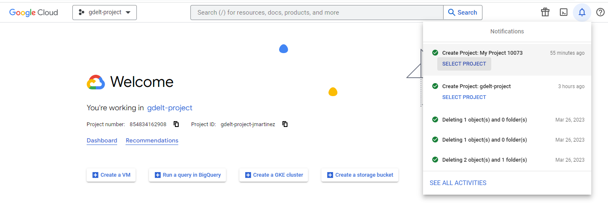
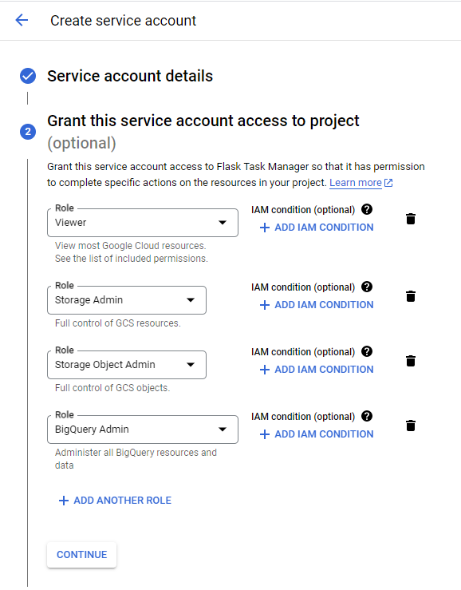

# Preparación del entorno y requerimientos del proyecto

## 1. Google Cloud: Proyecto y Credenciales
Debemos dirigirnos a [Google Cloud](https://console.cloud.google.com/) y crear un nuevo proyecto con el nombre de nuestra preferencia. Vamos a encontrar en nuestras notificaciones la opción de ingresar a nuestro nuevo proyecto.  


En la pantalla de inicio podemos encontrar nuestro project ID. Esta identificación nos va a ser muy útil en los próximos pasos.

En el panel izquierdo buscamos el submenú de ```IAM & Admin``` y seleccionamos la opción ```Service Accounts```.  
En el borde superior podemos encontrar la opción de ```CREATE SERVICE ACCOUNT```. Definimos el nombre y la descripción del servicio.  
En el punto 2 definimos los siguientes roles: ```Basic > Viewer```, ```Storage Admin```, ```Storage Object Admin```, ```BigQuery Admin```.  
.

En el menu Actions de nuestra lista de servicios seleccionamos la opción ```Manage Keys```. Luego creamos una Key en formato JSON.